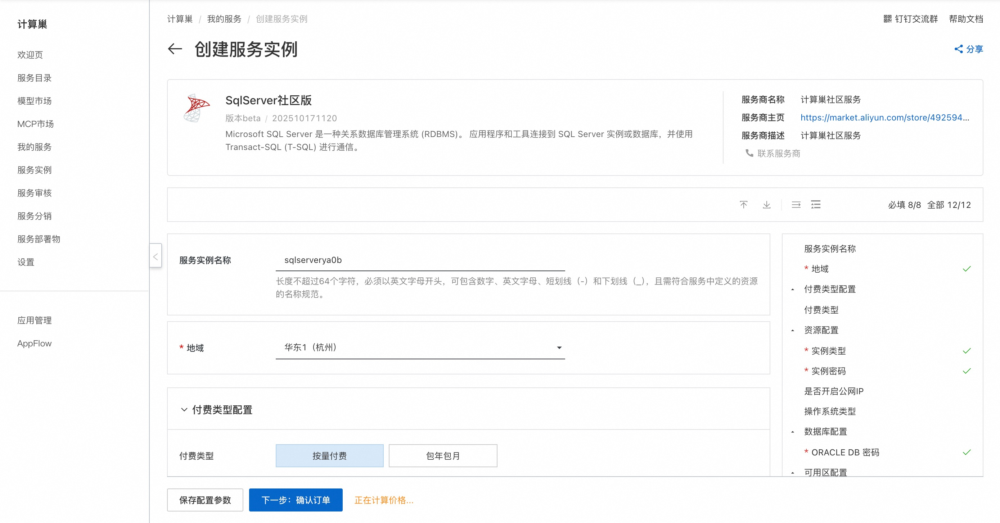
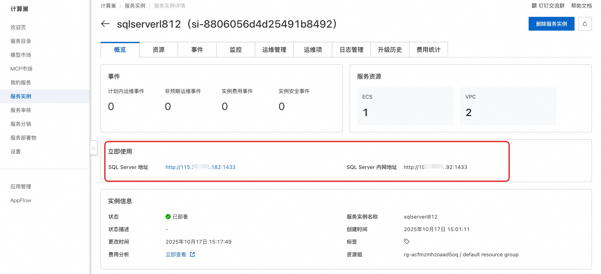
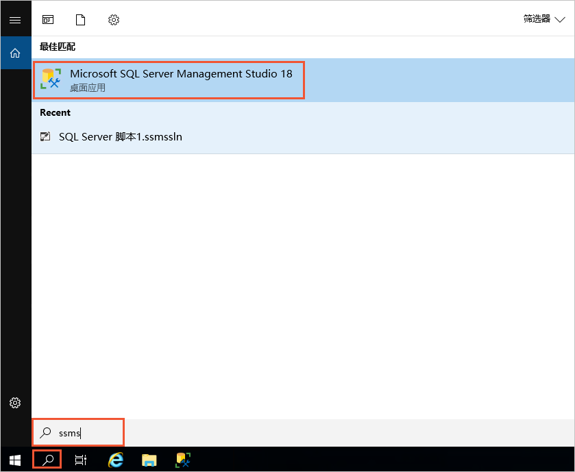
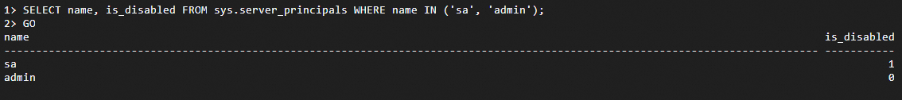

## 🌟 服务简介

SQL Server是由Microsoft开发和维护的关系型数据库管理系统（DBMS），广泛用于企业和组织的数据存储和管理。

## 🚀 部署流程

1. 访问计算巢SqlServer社区版[部署链接](https://computenest.console.aliyun.com/service/instance/create/cn-hangzhou?type=user&ServiceId=service-04edc57c62cd4c6b95b3)
，按提示填写部署参数：


2. 参数填写完成后可以看到对应询价明细，确认参数后点击**下一步：确认订单**。

3. 确认订单完成后同意服务协议并点击**立即创建**进入部署阶段。

4. 等待部署完成后进入服务实例详情页，获取服务地址。
   

## 📚 使用指南

### 链接SQL Server数据库（Windows版）

1. 使用Workbench工具以RDP协议登录Windows实例。

2. 在左下角搜索栏中输入ssms。
   

3. 单击Microsoft SQL Server Management Studio 18。

4. 在连接到服务器对话框中，设置服务器连接信息，单击连接。

### 连接SQL Server数据库（Linux版）并禁用 sa 账号

首次使用sa账号登录SQL Server后，为了确保系统安全，建议创建新账号并禁用sa账号的登录。

1. 远程连接ECS，首次登录账号使用sa。

   ```shell
   docker exec -it sqlserver /opt/mssql-tools18/bin/sqlcmd -No -S localhost -U sa
   ```
   参数值说明：

   -S：指定服务器的名称或IP地址。

   -U：用户名。

2. 创建新账号并禁用sa账号。
   ```shell
   CREATE LOGIN <YOUR_USER> WITH PASSWORD = '<YOUR_PASSWORD>';
   ```
   <YOUR_USER>替换为您要设置的账号。

   <YOUR_PASSWORD>替换为您要设置的密码。

   执行GO使命令生效。
   ```shell
   GO
   ```

3. 分配sysadmin角色。
   ```
   ALTER SERVER ROLE sysadmin ADD MEMBER <YOUR_USER>;
   ```
   执行GO使命令生效。
   ```shell
   GO
   ```

4. 禁用sa账号。
   ```shell
   ALTER LOGIN sa ENABLE;
   ```
   执行GO使命令生效。
   ```shell
   GO
   ```

5. 查看修改是否生效。
   ```shell
   SELECT name, is_disabled FROM sys.server_principals WHERE name IN ('sa', '<YOUR_USER>');
   ``` 
   执行GO使命令生效。
   ```shell
   GO
   ```
   如下图所示，is_disabled=1表示被禁用；is_disabled=0表示启用。
   

更多用法请参考SqlServer[官网文档](https://learn.microsoft.com/zh-cn/sql/sql-server/?view=sql-server-ver17)。